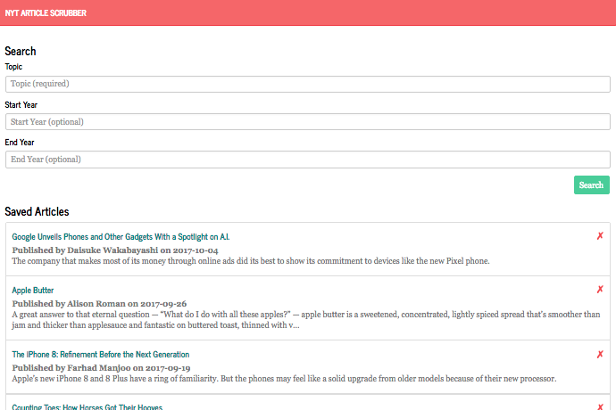

# NYT Article Archive
A full-stack React application that allows you to search for and archive articles from the New York Times. It is live at https://jons-nyt-archive.herokuapp.com.

## Description

This single-page application allows you to search the New York Times API for articles related and within a certain topic and timeframe. It will then the first ten results with links and basic information about each article. The user can either remove a certain article from search results or store them in the archive. They can also search for a new topic, as well as clear all search results.

Upon page load, this application will list all articles currently stored, along with the option to remove them from the archive.

### Development

This application was developed as part of the GW Coding Bootcamp and was completed at the end of the tenth week. It is a full-stack application organized with proper MVC design. The front-end uses React. The back-end uses Express, Body-Parser, and Axios for server functions, and Mongoose to connect to the NoSQL database.

### Organization

This repo can be cloned to your computer and accessed using the following commands:

		git clone https://github.com/jonchr/NYT_Article_Archive.git
		cd NYT_Article_Archive

The user may need to run their NoSQL server with the following commands:

		mongod
		mongo

They then can run the server and open the page in a new command prompt window using:

		yarn start

To stop each of these functions, press Control-C while in your command prompt window.

## Screenshots
### The main page - someone is a smartphone nerd.
